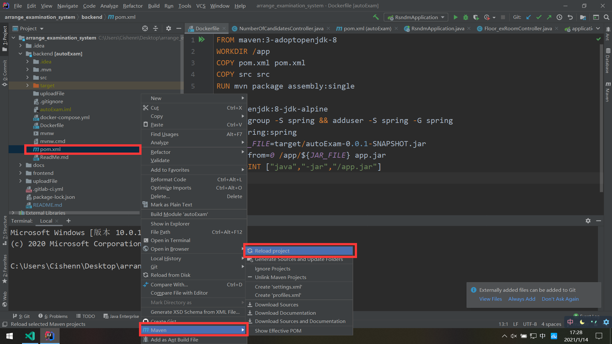
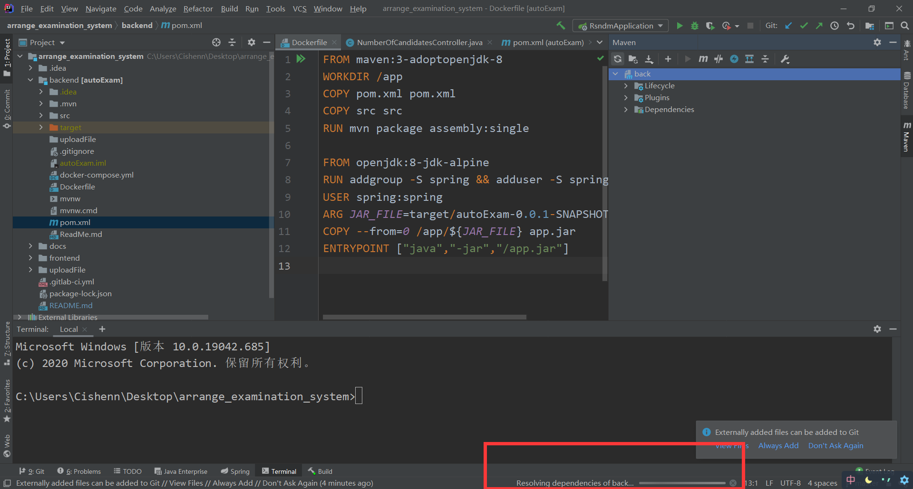
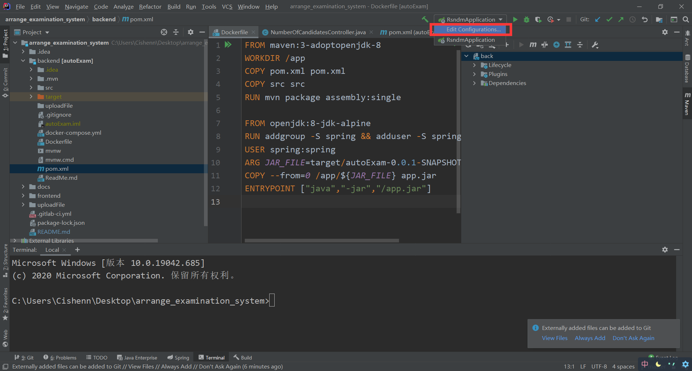
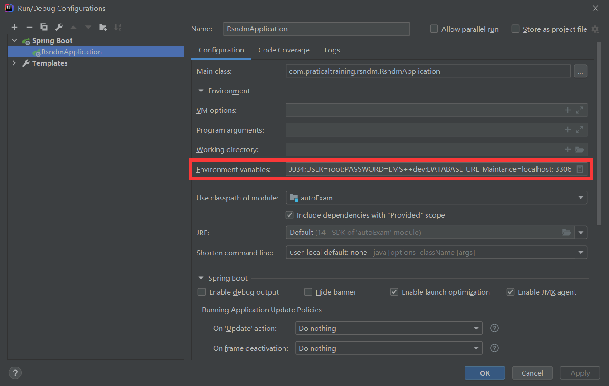
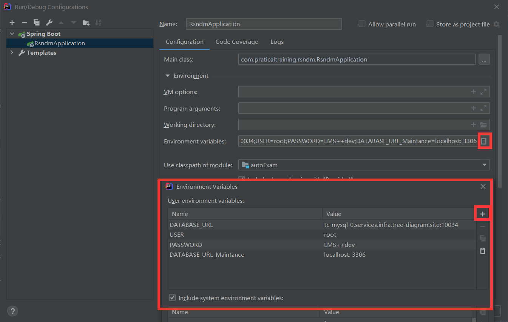

This is README.md
===================

## Project Structure
Repository owns two parts:

- Frontend is placed in ./frontend

- Backend is placed in ./backend

## Commit Tips
Project has added commit-message in ./.git/hooks to inspect commit message

Commit message should refer like "Added function feature. Ref #999"

## Deploy Rapidly

1. clone repository

```shell
git clone https://se.jisuanke.com/exam-schedular/ranshaonidemeng/arrange_examination_system.git
```

2. cd ./frontend

```shell
npm install
npm run serve
```

3. open backend with intellij IDEA

**Maven reload project**




***And the process maybe slow, provided your network is bad.***



4. config environment variables in Intellij IDEA




environment variables: ***`DATABASE_URL=tc-mysql-0.services.infra.tree-diagram.site:10034;USER=root;PASSWORD=LMS++dev`***




Configure is done




## References link(参考文档连接)

https://www.yuque.com/softwarejunior/vv6w86

Contains:


- 概要设计说明书
- 部署文档([快速部署](#deploy-rapidly))
- 需求分析报告
- 使用说明书
- 系统测试计划报告
- 详细设计说明书